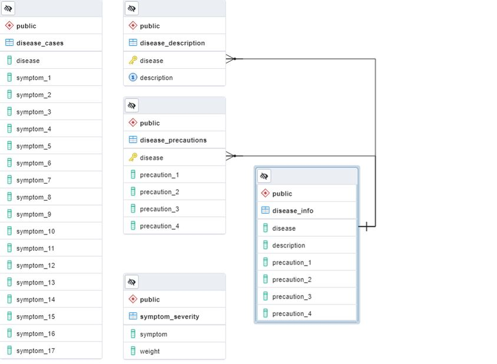
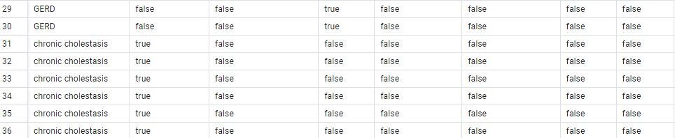

# Disease Prediction

The basis of this project is to use one or more machine learning models that can make accurate predictions of a disease by taking in arguments for symptoms (X) and predict the causative illness (y). This trained model will then be deployed to a webpage to accept user inputs and make real-time predictions. 

## Why Disease Prediction?
As a group, we wanted to work on something that we thought could have an impact on people. There are many people around the world suffering from various diseases. While this project will only function as a test, it is a good indication of what machine learning is capable of, and how it may be used in the future of healthcare.

[Link to Google Slides Presentation](https://docs.google.com/presentation/d/17sEjf6EPZSJ9EY5Vl9RA3tWl3OAGQc6XCYFe-FfR_w0/edit?usp=sharing)

## Dataset

The dataset contains four CSV files.

* [Disease Dataset](./Data/Cleaned/dataset_clean.csv) consists of 41 diseases and 131 possible symptoms. Each disease has 120 cases or incidences.

* [Disease Description](./Data/Cleaned/disease_description_clean.csv) is a list of the diseases with a brief description of each illness.

* [Symptom Severity](./Data/Cleaned/symptom_severity_clean.csv) is a list of all symptoms with a weight to indicate severity.

* [Symptom Precaution](./Data/Cleaned/disease_precaution_clean.csv) is a list of precautions to take for each disease.

### Data Cleaning & Processing

Many replacements were made to the dataset for the sake of clarity and consistency. The main dataset of disease symptoms per case was then transformed to contain columns for every possible symptom, each containing boolean values.

<!-- Pictures of the DataFrame before and after boolean transformation -->

This format can be much easier for any machine learning model to interpret, as it is already encoded/scaled.

## Machine Learning Model

Random Forest Classifier will be used as a benchmark classification model. Support vector machines and neural networks will be investigated.

Support vector machines work well on small datasets with clear separation between boundaries and don't perform as well on datasets with much noise. Neural networks can handle more complex problems but need more computational time and have more hyperparameters that can be adjusted.

sklearn's train_test_split was used to create the training and testing datasets.

* Symptom severity gives numerical weights to the severity of each symptom, and could be used as a feature in our ML model.

## Database

SQL will be used to create a relational database with multiple tables for Disease Description, Disease Precautions, and the main dataset.

* The first step in setting up the SQL database with our dataset is to create tables to import the data that we have. 
* The four tables initially created are:
  - "Disease_Cases" (to show the symptoms found in each case of the diseases in our dataset) 
  - "Disease_Descriptions" (to provide a brief description of the unique diseases in the dataset) 
  - "Disease_Precautions" (to provide possible precautions one can take if potentially facing one of the diseases)
  - "Symptom_Severity" (so that the symptoms of a disease can be weighed and more easily measured).
* With our data imported, we use the "Disease_Descriptions" and "Disease_Precautions" tables to create a new joined table called "Disease_Info" with all information on the diseases. 
* Now that we have some new tables, we can create new clean CSV files for them, and upload these to our repository Data section.
* With the preliminary tables finished, an ERD can also be generated to illustrate the different relationships between the data tables.

* The ERD shows that, using the primary key of "Disease" from the Disease Description table and the Disease Precaution table, we can join the two tables to create the more complete Disease Information table. 

* With the data cleaning process being complete, the Database was updated to use the new sets of clean data for the existing tables. These tables were then used to replace the initial SQL csv files that were created.
* Along with the updated tables, a new table was created for the Boolean values dataset. This tables contains a collumn for the Dieseases, as well as a collumn for each of the different 131 different symptoms. 

* Following the creation of the Database, we were able to use SQL alchemy to connect the database directly to our analysis and machine learning models. 
* With SQL alchemy connecting directly to the database, we could pull, or update, or create new tables and CSV files throough jupyter. This would be very helpful in updating the tables live as the data was cleaned. 

## Dashboard
The trained ML model can be deployed to a webpage. Using Flask/JavaScript, we can build a simple webpage that will allow the user to input symptoms they are experiencing and view the model's prediction of their illness. Recommendations for treatment/precautions can be displayed, based on [symptom_precaution.csv](./Data/symptom_precaution.csv) 

## Team Communication Protocol
The team meets twice per week via Zoom and uses Slack to communicate as needed. There is a Group Plan file to help document our upcoming goals and overall plan for the project.
