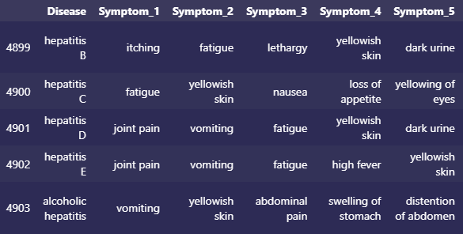
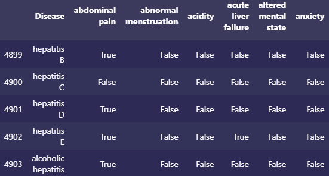

# Disease Prediction

There are many people around the world suffering from various diseases. These diseases, each requiring unique treatment, can be diagnosed by the symptoms they cause. We aim to train a machine learning model that can make accurate predictions using symptoms experienced to predict the causative illness. This trained model will then be deployed to a webpage to accept user inputs and make real-time predictions. We hope to showcase how ETL data analysis, full-stack development, and machine learning can be used to impact the future of healthcare.

### Why Disease Prediction?
As a group, we wanted to work on something that we thought could have an impact on people. There are many people around the world suffering from various diseases. While this project will only function as a test, it is a good indication of what machine learning is capable of, and how it may be used in the future of healthcare.

[Link to Google Slides Presentation](https://docs.google.com/presentation/d/17sEjf6EPZSJ9EY5Vl9RA3tWl3OAGQc6XCYFe-FfR_w0/edit?usp=sharing)

## Technologies Used

* Python, Pandas, Matplotlib, Pickle

* PostgreSQL, pgAdmin, SQLAlchemy

* sklearn, Decision Tree, Support Vector Machine

* HTML, CSS, JavaScript, Flask REST API

## Planned Data Pipeline

<!-- This section should stay written in the present tense. -->

1. Dataset is first cleaned of typographical errors and replacements are made to values for clarity.

2. Cleaned dataset is uploaded to SQL database.

3. ML model loads cleaned data from database using SQLAlchemy.

4. Cleaned dataset tranformed to boolean values for each symptom.

5. ML model is trained on encoded data.

6. ML model is saved as a pickle object.

7. Flask hosts webpage where user checks any experienced symptoms and submits.

8. REST API call sent to Flask with boolean for each symptom.

9. Flask uses unpickled model to make prediction.

10. SQLAlchemy is used to lookup the disease from the database to retrieve description and precautions.

11. API may also use a stored version of model's confusion matrix to suggest possible differential diagnosis.

12. JSON returned by API call used to update webpage with disease information.

## Dataset

The dataset contains four CSV files.

* [Disease Dataset](./Data/Cleaned/dataset_clean.csv) consists of 41 diseases and 131 possible symptoms. Each disease has 120 cases or incidences.

* [Disease Description](./Data/Cleaned/disease_description_clean.csv) is a list of the diseases with a brief description of each illness.

* [Symptom Severity](./Data/Cleaned/symptom_severity_clean.csv) is a list of all symptoms with a weight to indicate severity.

* [Disease Precaution](./Data/Cleaned/disease_precaution_clean.csv) is a list of precautions to take for each disease.

## Data Cleaning & Processing

Many replacements were made to the dataset for the sake of clarity and consistency. The main dataset of disease symptoms per case was then transformed to contain columns for every possible symptom, each containing boolean values.

### Before

### After

This format is much easier for any machine learning model to interpret, as it is already encoded and scaled.

## Machine Learning Model

Decision Tree Classifier was used as a benchmark classification model. Support Vector Classifier was investigated for superior performance. Support vector machines (SVM) work well on small datasets with clear separation between boundaries and don't perform as well on datasets with much noise.

The dataset was filled with many duplicates; removing these duplicates would drop the sample size for each disease from 120 to 5-10. Retaining these duplicates proved to make the models more robust against overfitting. The small effective size of the unduplicated dataset was mitigated by using a SVM classifier and using a 50/50 split between training and test data. sklearn's train_test_split() was used to create the training and testing datasets.

Decision Tree Classifier was trained with a max depth of 10 to prevent overfitting. Similarly, many values for the SVM 'gamma' and 'C' parameters were tried, until a model with a reasonable accuracy score and confusion matrix was returned. An [online introduction](https://vitalflux.com/svm-rbf-kernel-parameters-code-sample/) to these parameters was used to guide the selection of their values. The RBF kernel was used for the SVM due to its suitability for nonlinear data that is not well-known or characterized.

<!-- TODO: reframe/resize confusion matrices! -->

The decision tree benchmark performed decently at nearly 95% accuracy, yet the [confusion matrix](/Images/clf_confusion_matrix.png) reveals a practical issue with the model: many illnesses are sometimes falsely predicted as heart attacks!

The support vector machine performs at a better 98% accuracy and has a less worrying [confusion matrix](/Images/svm_confusion_matrix.png). Variations of hepatitis are sometimes confused with each other or another liver illness, chronic cholestasis. Drug reaction is sometimes misdiagnosed as acne, which should be straightforward for the end user to distinguish. This model appears to perform well in the context of accurately and reasonably diagnosing illness based on reported symptoms.

## Database

SQL will be used to create a relational database with multiple tables for Disease Description, Disease Precautions, and the main dataset.

* The first step in setting up the SQL database with our dataset is to create tables to import the data that we have. 
* The four tables initially created are:
  - "Disease_Cases" (to show the symptoms found in each case of the diseases in our dataset) 
  - "Disease_Descriptions" (to provide a brief description of the unique diseases in the dataset) 
  - "Disease_Precautions" (to provide possible precautions one can take if potentially facing one of the diseases)
  - "Symptom_Severity" (so that the symptoms of a disease can be weighed and more easily measured).
* With our data imported, we use the "Disease_Descriptions" and "Disease_Precautions" tables to create a new joined table called "Disease_Info" with all information on the diseases. 
* This disease information table can be used in the dashboard as well to provide further information about the user's disease results.
* Now that we have some new tables, we can create new clean CSV files for them, and upload these to our repository Data section.

## Dashboard
The trained ML model can be deployed to a webpage. Using Flask and JavaScript, we can build a simple webpage that will allow the user to input symptoms they are experiencing and view the model's prediction of their illness. Recommendations for treatment/precautions can be displayed, based on [symptom_precaution.csv](./Data/symptom_precaution.csv) 

We plan on using an API call to Flask to load the model prediction. The returned JSON object will also include information about the disease, such as a description and suggested treatment options. We will attempt to have Flask connect to the database using SQLAlchemy to lookup this information.

## Team Communication Protocol
The team meets twice per week via Zoom and uses Slack to communicate as needed. There is a Group Plan file to help document our upcoming goals and overall plan for the project.
